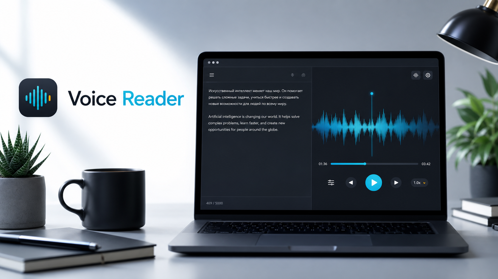
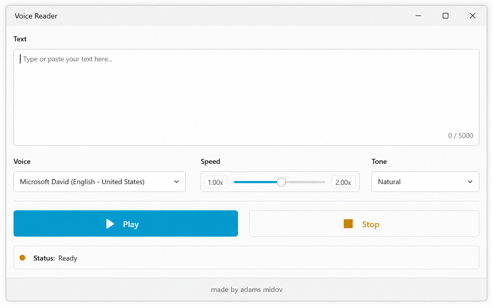

# Voice Reader



Voice Reader - настольное приложение для озвучивания текста естественным голосом. Пользователь вставляет текст, выбирает голос, скорость и тон, нажимает `Play` и сразу начинает слушать результат. Проект ориентирован на людей, которым удобнее воспринимать длинные тексты на слух: статьи, учебные материалы, рабочие заметки, сценарии, письма и черновики.



## Зачем создан проект

Я создал Voice Reader, потому что чтение больших объемов текста не всегда удобно и продуктивно. Часто текст нужно не просто прочитать, а быстро проверить на слух, прослушать во время работы, учебы или отдыха, найти ошибки в формулировках, подготовить материал для озвучки или сделать контент доступнее для людей, которым тяжело долго читать с экрана.

Идея проекта простая: превратить обычный текст в понятную, естественную речь без сложной настройки. В отличие от тяжелых студийных инструментов, Voice Reader делает основной сценарий максимально прямым: вставил текст, выбрал голос, запустил воспроизведение.

## Что это такое

Voice Reader - это MVP-приложение для генерации и воспроизведения речи из текста. В текущей версии проект включает:

- macOS/Python desktop-приложение на PyQt6.
- Windows-версию на C# WinForms.
- Docker CLI для генерации MP3 без запуска графического интерфейса.
- Генерацию речи через `edge-tts`.
- Воспроизведение MP3 через `pygame-ce` в Python-версии.
- Потоковую генерацию: воспроизведение стартует после первого готового фрагмента, пока остальной текст продолжает обрабатываться.

## Скачать готовую сборку

Готовые версии доступны в разделе [GitHub Releases](https://github.com/abbos-khamidov/voice-app-for-opencode/releases/latest). Для обычного пользователя это самый простой способ запуска: скачайте файл под свою систему, распакуйте архив при необходимости и откройте приложение.

### macOS

Сначала можно скачать архив:

[Скачать macOS ZIP](https://github.com/abbos-khamidov/voice-app-for-opencode/releases/latest/download/VoiceReader-macOS.zip)

Ниже доступен DMG-образ для MacBook:

[Скачать macOS DMG](https://github.com/abbos-khamidov/voice-app-for-opencode/releases/latest/download/VoiceReader-macOS.dmg)

В DMG приложение лежит как `Voice Reader.app` рядом с ярлыком `Applications`. Откройте DMG и перетащите `Voice Reader.app` в `Applications`.

Важно: если сборка не подписана Apple Developer ID и не прошла notarization, macOS может показать предупреждение Gatekeeper о неизвестном разработчике. Это не обходится настройкой DMG. Правильное решение - подписать и notarize сборку через Apple Developer account. Workflow уже подготовлен под это через GitHub Secrets, подробнее: [docs/MACOS_SIGNING.md](docs/MACOS_SIGNING.md).

### Windows

Сначала можно скачать полный архив:

[Скачать Windows ZIP](https://github.com/abbos-khamidov/voice-app-for-opencode/releases/latest/download/VoiceReader-Windows.zip)

Ниже доступен отдельный EXE-файл:

[Скачать Windows EXE](https://github.com/abbos-khamidov/voice-app-for-opencode/releases/latest/download/VoiceReader-Windows.exe)

## Важная заметка о приватности

**Voice Reader использует онлайн-генерацию речи через `edge-tts`. Когда вы нажимаете `Play`, введенный текст отправляется во внешний TTS-сервис.**

Не вставляйте пароли, API-ключи, приватные документы, медицинские данные, финансовые данные и другую чувствительную информацию, если не готовы к тому, что текст будет обработан внешним сервисом.

Подробнее: [PRIVACY.md](PRIVACY.md).

## Возможности

- Большое поле для вставки или набора текста.
- Кнопки `Play` и `Stop`.
- Выбор голосов Edge TTS:
  - Ava Multilingual Natural
  - Andrew Multilingual Natural
  - Emma Multilingual Natural
  - Brian Multilingual Natural
  - Jenny (US English)
  - Guy (US English)
  - Svetlana (Russian)
  - Dmitry (Russian)
- Регулировка скорости от 0.50x до 2.00x.
- Изменение скорости во время генерации и воспроизведения.
- Выбор тона:
  - Natural
  - Lively
  - Confident
  - Soft
- Очистка текста от лишних символов перед озвучиванием.
- Корректная работа со смешанным русско-английским текстом.
- Генерация итогового файла `speech.mp3`.
- Воспроизведение по частям без ожидания полной генерации всего текста.
- Базовые статусы и сообщения об ошибках.
- Подпись `made by adams midov` в интерфейсе.

## Как это работает

1. Пользователь вставляет текст в приложение.
2. Приложение очищает текст от технических символов и лишних пробелов.
3. Текст разбивается на читаемые фрагменты, чтобы генерация была стабильнее.
4. Для каждого фрагмента создается MP3 через `edge-tts`.
5. Первый готовый фрагмент сразу отправляется на воспроизведение.
6. Остальные фрагменты генерируются в фоне.
7. Все фрагменты объединяются в итоговый файл `speech.mp3`.

Такой подход делает приложение более отзывчивым: пользователю не нужно ждать, пока будет обработан весь большой текст.

## Установка на macOS для разработки

Требования:

- macOS.
- Python 3.10 или новее.
- Доступ в интернет во время генерации речи.
- Рабочий аудиовыход.

```bash
python3 -m venv .venv
source .venv/bin/activate
pip install -r requirements.txt
python main.py
```

## Инструкция по использованию

1. Вставьте или напишите текст в большое поле.
2. Выберите голос.
3. Выберите скорость озвучивания.
4. Выберите тон речи.
5. Нажмите `Play`.
6. При необходимости измените скорость во время воспроизведения.
7. Нажмите `Stop`, чтобы остановить генерацию и воспроизведение.

Готовый MP3-файл сохраняется как `speech.mp3` в папке проекта.

## Windows-версия

Windows-версия находится в папке `windows/VoiceReader.Windows`.

Требования:

- Windows 10 или новее.
- .NET 8 SDK.
- Python с установленным `edge-tts`.

Установка зависимости:

```powershell
py -m pip install edge-tts
```

Запуск:

```powershell
cd windows\VoiceReader.Windows
dotnet run
```

Подробности находятся в [windows/README.md](windows/README.md).

## Docker

Docker используется для CLI-генерации MP3. Графический интерфейс в контейнере не запускается, потому что desktop GUI и звук зависят от аудио- и оконной системы хоста.

Сборка:

```bash
docker build -f docker/Dockerfile -t text-reader-tts .
```

Пример запуска:

```bash
docker run --rm -v "$PWD:/app/output" text-reader-tts \
  --text "Привет. Hello from Docker." \
  --voice en-US-AvaMultilingualNeural \
  --output /app/output/speech.mp3
```

Подробности находятся в [docker/README.md](docker/README.md).

## Архитектура проекта

```text
voice-app-for-opencode/
├── main.py                         # Точка входа macOS/Python-приложения
├── ui/main_window.py               # Главное окно, управление UI и потоковой генерацией
├── services/tts_service.py         # Подготовка текста и генерация речи через edge-tts
├── services/audio_service.py       # Воспроизведение аудио через pygame
├── assets/                         # Логотип, баннер и изображения для README
├── tests/                          # Тесты TTS-логики
├── .github/workflows/              # CI и сборка downloadable artifacts
├── windows/VoiceReader.Windows/    # Windows-приложение на C# WinForms
└── docker/                         # Docker CLI для генерации MP3
```

## Тесты

```bash
pip install -r requirements.txt
pip install -r requirements-dev.txt
pytest
```

## Позиционирование для продвижения

Voice Reader можно продвигать как простой инструмент для превращения текста в естественную речь:

> Voice Reader помогает слушать тексты вместо того, чтобы читать их с экрана. Вставьте статью, заметку, сценарий или учебный материал, выберите голос и получите озвучку с регулируемой скоростью и тоном.

Короткое описание:

> Настольное приложение для озвучивания текста на русском и английском с естественными голосами, регулировкой скорости и сохранением MP3.

Для кого:

- для учебы;
- для работы с длинными текстами;
- для авторов и редакторов;
- для подготовки аудиоконтента;
- для людей, которым удобнее слушать, чем читать.

## Ограничения

- Для генерации речи нужен интернет.
- Введенный текст обрабатывается внешним онлайн TTS-сервисом через `edge-tts`.
- Сейчас приложение работает как MVP, поэтому в нем нет полноценной системы проектов, истории и аккаунтов.
- Качество и доступность голосов зависят от `edge-tts` и используемого онлайн-сервиса.
- Python-версия ориентирована на macOS, Windows-версия находится в отдельной папке.

## Документы проекта

- [MIT License](LICENSE)
- [Privacy Notice](PRIVACY.md)
- [Roadmap](ROADMAP.md)
- [Changelog](CHANGELOG.md)
- [Contributing](CONTRIBUTING.md)

## Источники и ориентиры

- `edge-tts` предоставляет Python-модуль и CLI для работы с онлайн-сервисом Microsoft Edge Text-to-Speech: https://github.com/rany2/edge-tts
- Microsoft описывает современные TTS-сценарии через естественное звучание, настройку скорости, высоты, пауз и интонации: https://azure.microsoft.com/en-us/products/ai-services/text-to-speech/
- Документация Microsoft по голосам отмечает multilingual neural voices и развитие более контекстных HD-голосов: https://learn.microsoft.com/en-us/azure/ai-services/speech-service/language-support
- MDN/WCAG объясняет принцип воспринимаемости: информация должна быть доступна пользователю через разные способы восприятия: https://developer.mozilla.org/en-US/docs/Web/Accessibility/Guides/Understanding_WCAG/Perceivable
- Harvard Library подчеркивает важность понятной структуры и простого языка для доступности, особенно для пользователей с дислексией и ADHD: https://library.harvard.edu/accessible-content-guidelines
